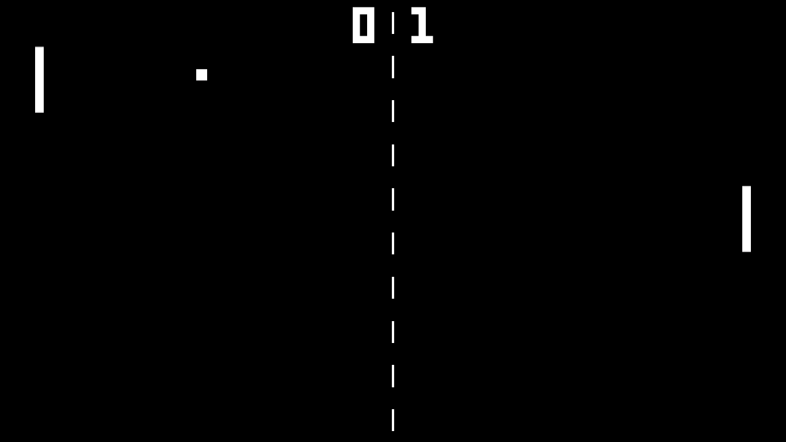

# Unity-Pong-Game

In December 2022 In Yazdan Panah University, for advanced programming class, the students were tasked to create a simple game using c# and unity.

> Pong is a table tennis-themed arcade video game, featuring simple two-dimensional graphics, manufactured by Atari and originally released in 1972. It was one of the earliest arcade video games; it was created by Allan Alcorn as a training exercise assigned to him by Atari co-founder Nolan Bushnell, but Bushnell and Atari co-founder Ted Dabney were surprised by the quality of Alcorn's work and decided to manufacture the game. Bushnell based the game's concept on an electronic ping-pong game included in the Magnavox Odyssey, the first home video game console.

## Game Elements

The game had some factors such as:
- Ball
- Player Paddle
- Computer Paddle with AI
